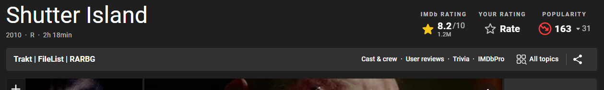

To be used with [Violentmonkey](https://violentmonkey.github.io/) or another userscript manager.

## Features

Adds direct links to Trakt and Filelist on the movie page.

## Installation

Just [click here](https://github.com/danielvigaru/imdb-trakt-and-tracker-links.user.js/raw/main/imdb-trakt-and-tracker-links.user.js) or select `Install from URL` and use the direct link to the script `https://github.com/danielvigaru/imdb-trakt-and-tracker-links.user.js/raw/main/imdb-trakt-and-tracker-links.user.js`.
